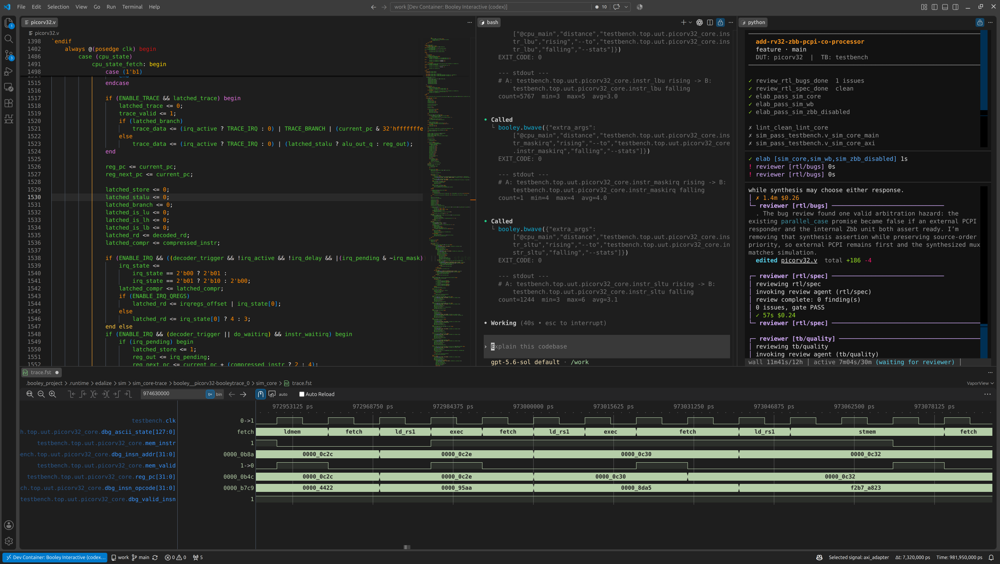

# Booley

**The open-source agentic RTL IDE**

[](https://github.com/boldaxolotl/booley/actions/workflows/test.yml)
[](https://pypi.org/project/booley-rtl/)
[](https://opensource.org/licenses/Apache-2.0)
[](https://www.python.org/downloads/)



## Integrated Development Environment

RTL development is fragmented across editors, tool-specific commands, build environments, logs, and waveform viewers. Booley brings that workflow together in one reproducible VS Code workspace.

- **One Window:** RTL, the agent, terminals, EDA runs, results, and waveform viewing live in a single VS Code window. You can move from editing to simulation to waveform debugging to synthesis without switching between separate applications.
- **Reproducible team environment:** configure the project once, and its Docker environment supplies the same pinned EDA stack, agent tooling, and system dependencies to every team member. Nobody has to rebuild the toolchain independently or debug "works on my machine" differences ([why Docker](https://github.com/boldaxolotl/Booley/blob/main/docs/internals/WHY.md#why-docker)).
- **A typed interface for each Booley Flow:** simulation, lint, synthesis, and FPGA implementation are separate Flows, each with typed inputs and structured, Flow-specific results. Each Flow's Booley interface remains stable regardless of which underlying EDA tool its Target selects—for example, `sim` stays `sim` with Verilator today or Xcelium<sup>*</sup> tomorrow. These Flows are built on [FuseSoC](https://github.com/olofk/fusesoc), so you don't have to maintain tool-specific EDA glue scripts anymore.

<sub>* Xcelium support is a work in progress.</sub>

## Built for agentic workflows

The mental model behind Booley is simple: treat an LLM agent like a talented junior engineer. It can write RTL and testbenches, but it is inexperienced with EDA tools, prone to questionable design decisions, and too risky to give unrestricted host access—it could, for example, force-push to your Git repository and rewrite its history. Booley gives it a constrained workspace, explicit specifications, automated checks, and human review.

- **Sandboxed for autonomous execution:** the agent and every command it launches run inside a Docker container with restricted mounts and network access. You can delegate long-running tasks to agents without approving every bash tool call and without worrying about your files and git history ([details](https://github.com/boldaxolotl/Booley/blob/main/docs/user/FEATURES.md#docker-sandboxing), [security model](https://github.com/boldaxolotl/Booley/blob/main/docs/internals/ARCHITECTURE.md#security--trust-model)).
- **Strict guardrails and acceptance criteria:** in Ticket Mode, the Harness checks explicit acceptance criteria you define during ticket creation. Area and cycle-count criteria help the agent stay within the project's PPA budget, while coverage and mutation-testing criteria help it write stronger testbenches. At review time, one briefing shows scope deviations and the results of configured checks, so you can see at a glance what passed and what needs attention ([details](https://github.com/boldaxolotl/Booley/blob/main/docs/user/USAGE.md#acceptance-criteria)).
- **Waveform-aware debugging:** `bwave` lets the agent query real traces instead of guessing from RTL. Ask “How many `i_ready`/`o_valid` handshakes occurred between 1,000 and 2,000 ns?” or “When did `data_o` equal `0xDEADBEEF`?” The agent answers from actual simulation data instead of spending minutes reasoning from code (and getting it wrong) ([details](https://github.com/boldaxolotl/Booley/blob/main/docs/user/FEATURES.md#waveform-based-debug)).

There are two ways you can cooperate with LLM agents in Booley:
- **Interactive Mode** - unlike a plain Claude Code or Codex chat, the agent starts with immediate access to the project's available Booley Flows and Specialists and already knows its Targets and tests. From your first prompt, it is ready to inspect or edit RTL, run a simulation, lint, or synthesis Flow, and call a Specialist. You remain in the loop, guiding the work and making decisions as they come up.
- **Ticket Mode** - the autonomous path. You write a ticket, specifying what needs doing, which files are in scope, which tests must pass, and any other completion criteria. Booley creates an isolated worktree, where the Developer Agent runs any Booley Flows and Specialist reviews required by the ticket's acceptance criteria; the Harness tracks completion and hands you a review-ready result.

See [FEATURES.md](https://github.com/boldaxolotl/Booley/blob/main/docs/user/FEATURES.md) for the full list of capabilities.

## Installation

Booley supports Windows and Linux (Ubuntu 24.04 tested); macOS is not
supported. You need:

- Python 3.11+
- [Docker](https://www.docker.com/)
- [VS Code](https://code.visualstudio.com/) with the [Dev Containers extension](https://marketplace.visualstudio.com/items?itemName=ms-vscode-remote.remote-containers)
- Credentials for Claude (the default) or Codex
- Roughly **6 GB of Docker storage** for the standard sandbox, proxy, and
  reaper images, plus additional disk space for project build artifacts

Install and verify the CLI on the host:

```bash
pipx install booley-rtl # or: pip install booley-rtl
booley --version
booley bootstrap
```

`pipx` is recommended because it avoids system-Python conflicts. Windows users
should run the CLI natively, not inside WSL. See
[Troubleshooting](https://github.com/boldaxolotl/Booley/blob/main/docs/user/TROUBLESHOOTING.md)
for first-run, PATH, and Python-environment problems, then continue to
[Setup](https://github.com/boldaxolotl/Booley/blob/main/docs/user/SETUP.md).
`booley bootstrap` prepares reusable host resources: skills, the shared PDK
cache, the base Session Image, and global Interactive Mode services. It is
recommended after installation and upgrades, but optional before Project work:
ordinary `booley init` performs the same reconciliation first.

## Quick Start

Three ways in, ordered by how much you want to invest:

1. **[Level 1: Watch](#level-1-watch).** See an engineer drive Booley on a demo project, start to finish. Zero setup.
2. **[Level 2: Try the demo yourself](#level-2-try-the-demo-yourself).** Clone the configured demo, create a Ticket with the bundled ticket-creation skill, and run your own change.
3. **[Level 3: Use it on your own project](#level-3-use-it-on-your-own-project).** Full integration on your own RTL.

### Level 1: Watch

Four videos show an engineer driving Booley on a demo project end to end, so viewers can see the workflow before touching anything:

1. **[Design Optimization](https://youtu.be/zHuvU4QJbvE)** (12:43)
2. **[Finding and Fixing Bugs](https://youtu.be/hsYHHZcx82w)** (9:40)
3. **[Feature Ticket Creation](https://youtu.be/sy1KMCHYnEw)** (10:36)
4. **[Ticket Results Review](https://youtu.be/nHOgd5Jz6Eo)** (11:21)

The project's author recorded all four videos, then replaced the original narration with text-to-speech to preserve anonymity for now.

### Level 2: Try the demo yourself

**The demo IP** is [picorv32](https://github.com/YosysHQ/picorv32), Claire Wolf's open-source RISC-V CPU core. It is a small, area-optimized design with a straightforward multi-cycle architecture. That makes the RTL easy to understand and keeps lint, simulation, and synthesis runs fast, while still exercising Booley on a real project rather than a toy example.

First, complete the [installation](#installation) above.

Then follow the [demo repository's README](https://github.com/boldaxolotl/booley-prj-picorv32#readme) to try it yourself.
Start in **Interactive Mode**: ask the agent to explain the design, inspect a
Target, and run a lint or simulation Flow while you guide it. Once that feels
familiar, try **Ticket Mode** as the optional autonomous workflow by creating a
Ticket against the live design. The repository intentionally contains no
pre-made Tickets.

### Level 3: Use it on your own project

Follow [SETUP.md](https://github.com/boldaxolotl/Booley/blob/main/docs/user/SETUP.md) to integrate Booley with your own RTL project.

## Supported EDA Tools

Current integrations:

- **Simulate / elaborate** — Verilator, Icarus Verilog; cocotb testbenches supported
- **Lint** — Verilator, Verible
- **ASIC synthesis** (PPA estimate, not tape-out) — logical Yosys or physical Yosys + OpenROAD
- **Waveform debug** — `bwave` (+ VaporView GUI in VS Code)
- **FPGA implementation** — AMD Vivado
- **Coming soon** — Synopsys VCS, Cadence Xcelium

For exact versions, provisioning, trace support, and platform constraints, see
**[SUPPORTED-EDA-TOOLS.md](https://github.com/boldaxolotl/Booley/blob/main/docs/user/SUPPORTED-EDA-TOOLS.md)**.
Support for additional commercial EDA tools is coming soon; see the
[roadmap](https://github.com/boldaxolotl/Booley/blob/main/docs/internals/ROADMAP.md#commercial-eda-tools).

## Limitations

- **The IDE shell is stock VS Code today.** Booley brings its agent chat, reproducible environment, EDA Flows, and waveform tooling together inside VS Code; it does not yet ship custom editor chrome or a standalone IDE. Native VS Code UI and, longer term, a VS Code fork are planned ([roadmap](https://github.com/boldaxolotl/Booley/blob/main/docs/internals/ROADMAP.md#native-ide-surface-in-vs-code)).
- **Booley will not design hardware for you.** You design the architecture and write the specs; Booley handles the grunt work. Force multiplier, not replacement.
- **You need prior digital design experience.** Even the most advanced LLM is useless without electronic engineering fundamentals; Booley assumes you can read RTL, judge a waveform, and know what a sane result looks like.
- **Source languages are SystemVerilog and Verilog only.** VHDL is not supported.
- **Testbenches are simple and direct.** Direct SystemVerilog and cocotb testbenches are supported; UVM is not.
- **Only tested at the IP level.** Complex IPs, like a RISC-V core or crypto accelerators, but never chip- or SoC-level integration. See [Ports](https://github.com/boldaxolotl/Booley/blob/main/docs/user/SETUP.md#ports) for what has actually been through it.
- **Setup can take effort.** I've tried to make the setup process as streamlined as possible, but every build system is different; complex flows or heavy licensed EDA tools may still need project-specific work. It's a price you pay once, though. After that, every ticket and every session builds on it, and development speeds up significantly.
- **The code quality is "hardware engineer writing software."** The architecture is sound, but the Python could use polish. Contributions from actual software developers are very welcome.
- **Work in progress.** Expect occasional bugs and rough edges in the UI. I'm actively on it, and things keep getting better.

## Documentation

- [Features](https://github.com/boldaxolotl/Booley/blob/main/docs/user/FEATURES.md)
- [Architecture](https://github.com/boldaxolotl/Booley/blob/main/docs/internals/ARCHITECTURE.md)
- [Setup](https://github.com/boldaxolotl/Booley/blob/main/docs/user/SETUP.md)
- [Usage](https://github.com/boldaxolotl/Booley/blob/main/docs/user/USAGE.md)
- [Flow reference](https://github.com/boldaxolotl/Booley/blob/main/docs/user/FLOW_REFERENCE.md)
- [Supported EDA tools](https://github.com/boldaxolotl/Booley/blob/main/docs/user/SUPPORTED-EDA-TOOLS.md)

## Contributing

Booley is still early, so the most useful contribution is trying it and reporting what works, what doesn't, and what you want next. Tell **`/booley-feedback`** in your agent chat; it gathers and redacts any needed evidence. Opinions need no reproduction, and nothing leaves your machine until you approve the exact text ([feedback guide](https://github.com/boldaxolotl/Booley/blob/main/docs/user/USAGE.md#when-booley-itself-misbehaves), [configuration](https://github.com/boldaxolotl/Booley/blob/main/docs/user/CONFIG.md#feedback-feedback)).

Code and documentation contributions are welcome; see [CONTRIBUTING.md](https://github.com/boldaxolotl/Booley/blob/main/docs/internals/CONTRIBUTING.md). Please keep feedback technical and specific; broader debates about AI's effects on society or employment are outside the project's scope.

For suspected vulnerabilities, follow the private reporting process in [SECURITY.md](https://github.com/boldaxolotl/Booley/blob/main/SECURITY.md) instead of opening a public issue.

## Acknowledgments

Booley stands on a lot of other people's work. Thank you to:

- **The authors of [Edalize](https://github.com/olofk/edalize) and [FuseSoC](https://github.com/olofk/fusesoc)**, and especially their lead maintainer, Olof Kindgren, for the framework that makes Booley's whole idea of a simple, unified CLI-over-EDA interface possible.
- **The author of [vcdvcd](https://github.com/cirosantilli/vcdvcd), Ciro Santilli**, for the VCD-parsing work that seeded the `bwave` idea.
- **The author of [wavepeek](https://github.com/kleverhq/wavepeek)**, another neat waveform-to-CLI EDA tool, for the clean top-level CLI interface that inspired `bwave`'s top-level CLI (the internals started well before wavepeek and are quite different).
- **The author of [VaporView](https://github.com/Lramseyer/vaporview), Lloyd Ramseyer**, for the excellent VS Code waveform viewer that `bwave gui` drives for scoped waveform inspection right in the IDE.
- **The authors of [Yosys](https://github.com/YosysHQ/yosys), [Verilator](https://github.com/verilator/verilator), [Icarus Verilog](https://github.com/steveicarus/iverilog), [Verible](https://github.com/chipsalliance/verible), and [sv2v](https://github.com/zachjs/sv2v)**, for the excellent open-source EDA tools that make Booley possible at all.
- **[Matt Pocock](https://www.aihero.dev/)**, for his great agentic software engineering techniques, which shaped how Booley's agents are built and driven.

## License

Apache 2.0. See [LICENSE](https://github.com/boldaxolotl/Booley/blob/main/LICENSE) for details.
