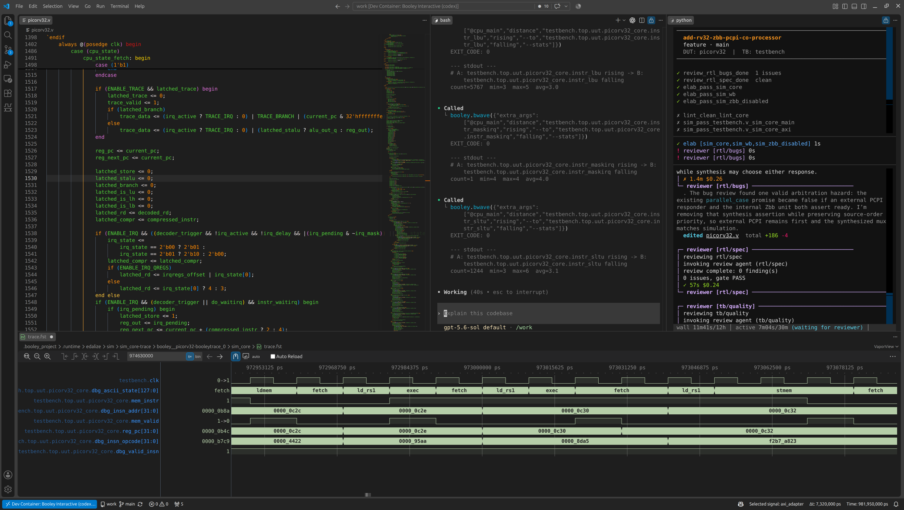

# Booley

**The open-source agentic RTL IDE**

[](https://github.com/boldaxolotl/Booley/actions/workflows/test.yml)
[](https://pypi.org/project/booley-rtl/)
[](https://opensource.org/licenses/Apache-2.0)
[](https://www.python.org/downloads/)

Booley turns Claude Code or Codex into a capable RTL assistant. It runs the agent in a sandbox, hands it real EDA tools, and checks its work against your acceptance criteria: passing tests, area and timing budgets, cycle counts, coverage, and more. You design; it does the grunt work.



## Integrated Development Environment

RTL development is fragmented across editors, tool-specific commands, build environments, logs, and waveform viewers. Booley brings that workflow together in one reproducible VS Code workspace.

- **One Window:** RTL, the agent, terminals, EDA runs, results, and waveform viewing live in a single VS Code window. You can move from editing to simulation to waveform debugging to synthesis without switching between separate applications.
- **Reproducible team environment:** configure the project once, and its Docker environment supplies the same pinned EDA stack, agent tooling, and system dependencies to every team member. Nobody has to rebuild the toolchain independently or debug "works on my machine" differences ([why Docker](https://github.com/boldaxolotl/Booley/blob/main/docs/internals/WHY.md#why-docker)).
- **A typed interface for each Booley Flow:** a Flow is one command (`sim`, `lint`, `synth`, or `fpga`) that runs an EDA job end to end and returns a structured result: pass/fail plus metrics such as area, timing, or cycle counts, instead of a raw log to grep. Each Flow's interface stays the same across EDA tools and across projects: `sim` stays `sim` whether it runs Verilator today or Xcelium<sup>*</sup> tomorrow, and on every project you work on. Flows are built on [FuseSoC](https://github.com/olofk/fusesoc), so there's no per-repo EDA glue to learn or maintain.

<sub>* Xcelium support is a work in progress.</sub>

## Built for agentic workflows

The mental model behind Booley is simple: treat an LLM agent like a talented junior engineer. It can write RTL and testbenches, but it is inexperienced with EDA tools, prone to questionable design decisions, and too risky to give unrestricted host access—it could, for example, force-push to your Git repository and rewrite its history. Booley gives it a constrained workspace, explicit specifications, automated checks, and human review.

- **Sandboxed for autonomous execution:** the agent and every command it launches run inside a Docker container with restricted mounts and network access. You can delegate long-running tasks to agents without approving every bash tool call and without worrying about your files and git history ([details](https://github.com/boldaxolotl/Booley/blob/main/docs/user/FEATURES.md#docker-sandboxing), [security model](https://github.com/boldaxolotl/Booley/blob/main/docs/internals/ARCHITECTURE.md#security--trust-model)).
- **Strict guardrails and acceptance criteria:** in Goal Mode, Booley checks mandatory Goals chosen at entry. Area and cycle-count criteria help the agent stay within the project's PPA budget, while coverage and mutation-testing criteria help it write stronger testbenches. At review time, one briefing shows Goal changes, Target and constraint edits, and evidence, so you can see at a glance what passed and what needs attention ([details](https://github.com/boldaxolotl/Booley/blob/main/docs/user/USAGE.md#goal-mode)).
- **Waveform-aware debugging:** `bwave` lets the agent query real traces instead of guessing from RTL. Ask "How many `i_ready`/`o_valid` handshakes occurred between 1,000 and 2,000 ns?" or "When did `data_o` equal `0xDEADBEEF`?" The agent answers from actual simulation data instead of spending minutes reasoning from code (and getting it wrong) ([details](https://github.com/boldaxolotl/Booley/blob/main/docs/user/FEATURES.md#waveform-based-debug)).

Use **Interactive Mode** to explore, debug, and call Flows and Specialists with
an agent in the Sandbox. Enter **Goal Mode** with `/booley-goal` when work needs
explicit completion conditions. The same session can run with your guidance or
unattended, in its own linked worktree and Goal Branch. Booley tracks evidence
and requires every Goal to be met before Finish returns a Review Package.

A **Goalset** is Project-owned Markdown under `.booley_project/goalsets/`.
The agent translates its prose into concrete Goals at entry. For example:

> **Goalset: fifo-feature**
> Lint the FIFO, pass its simulation suite, reach at least 90% line coverage,
> finish an RTL bug review clean, and synthesize within 10% of the base area.

```json
[
  {"family": "lint", "target": "lint_fifo", "origin": "fifo-feature"},
  {"family": "sim", "target": "sim_fifo", "origin": "fifo-feature"},
  {"family": "coverage", "target": "sim_fifo", "tests": "all", "metrics": {"line": 90}, "origin": "fifo-feature"},
  {"family": "review", "review": "rtl_bugs", "verdict": "clean", "origin": "fifo-feature"},
  {"family": "synth", "target": "synth_fifo", "thresholds": {"area_increase_at_most": "10%"}, "origin": "fifo-feature"}
]
```

See [FEATURES.md](https://github.com/boldaxolotl/Booley/blob/main/docs/user/FEATURES.md) for the full list of capabilities.

## Quick Start

Three ways in, ordered by how much you want to invest:

1. **[Level 1: Watch](#level-1-watch).** See an engineer drive Booley on a demo project, start to finish. Zero setup.
2. **[Level 2: Try the demo yourself](#level-2-try-the-demo-yourself).** Clone the configured demo, enter Goal Mode with `/booley-goal`, and run your own change.
3. **[Level 3: Use it on your own project](#level-3-use-it-on-your-own-project).** Full integration on your own RTL.

### Level 1: Watch

Two videos show an engineer driving Booley on a demo project end to end, so viewers can see the workflow before touching anything:

1. **[Design Optimization](https://youtu.be/zHuvU4QJbvE)** (12:43)
2. **[Finding and Fixing Bugs](https://youtu.be/hsYHHZcx82w)** (9:40)

I recorded both videos, then replaced my narration with text-to-speech to stay anonymous for now.

### Level 2: Try the demo yourself

**[Follow the demo repository's README](https://github.com/boldaxolotl/booley-prj-picorv32#readme)** to try the demo, after you [install Booley](#installation).

### Level 3: Use it on your own project

Follow [SETUP.md](https://github.com/boldaxolotl/Booley/blob/main/docs/user/SETUP.md) to integrate Booley with your own RTL project, after you [install Booley](#installation).

## Installation

Booley supports Windows and Linux (Ubuntu 26.04 tested); macOS is not
supported. You need:

- Python 3.11+
- [Git 2.37.2+](https://git-scm.com/downloads)
- [Docker](https://www.docker.com/), with about **4 GB** free for the image
  (**6 GB** with the RISC-V toolchain) plus room for build artifacts
- [VS Code](https://code.visualstudio.com/)
- A host agent CLI on PATH for Project Setup: [Claude Code](https://code.claude.com/docs/en/setup)
  (`claude`, the default) or [Codex](https://developers.openai.com/codex/cli) (`codex`)
- Credentials for the installed agent CLI

Use pipx to install the CLI in a persistent, isolated environment.
On **Ubuntu/Debian**, first prepare pipx:

<!-- booley-smoke:prepare -->
```bash
sudo apt-get update
sudo apt-get install -y pipx
pipx ensurepath
```
<!-- /booley-smoke:prepare -->

**Reopen your terminal** before running the install block so the pipx launcher
is on `PATH`. On Windows, install pipx with `py -m pip install --user pipx`,
run `py -m pipx ensurepath`, and reopen the terminal first.

Install your host agent CLI using the instructions linked above, then install
Booley and prepare the host:

<!-- booley-smoke:install -->
```bash
pipx install booley-rtl
booley bootstrap
```
<!-- /booley-smoke:install -->

To upgrade an existing install:

<!-- booley-smoke:upgrade -->
```bash
pipx upgrade booley-rtl
booley bootstrap --update
```
<!-- /booley-smoke:upgrade -->

If you already have uv, `uv tool install booley-rtl` and
`uv tool upgrade booley-rtl` are equivalent; follow them with
`booley bootstrap` and `booley bootstrap --update`, respectively.

**Alternative: pip user install**, only for interpreters that permit user
installs (including Windows). Ensure the user scripts directory is on `PATH`:

```bash
python3 -m pip install --user booley-rtl
booley bootstrap
```

On Windows use `py -m pip` in place of `python3 -m pip`. To upgrade this
alternative, run `python3 -m pip install --user --upgrade booley-rtl`, then
`booley bootstrap --update`.

Seeing `externally-managed-environment`, PATH, or other install errors? See
[Troubleshooting](https://github.com/boldaxolotl/Booley/blob/main/docs/user/TROUBLESHOOTING.md#installation-fails-with-externally-managed-environment).

**Next:** [try the demo](#level-2-try-the-demo-yourself) or [set up your own project](#level-3-use-it-on-your-own-project).

## Supported EDA Tools

Current integrations:

- **Simulate / elaborate** — Verilator, Icarus Verilog; cocotb testbenches supported
- **Lint** — Verilator, Verible
- **ASIC synthesis** (PPA estimate, not tape-out) — logical Yosys or physical Yosys + OpenROAD
- **Waveform debug** — `bwave` (+ VaporView GUI in VS Code)
- **FPGA implementation** — AMD Vivado
- **Coming soon** — Synopsys VCS, Cadence Xcelium

For exact versions, provisioning, trace support, and platform constraints, see
**[SUPPORTED-EDA-TOOLS.md](https://github.com/boldaxolotl/Booley/blob/main/docs/user/SUPPORTED-EDA-TOOLS.md)**.
Support for additional commercial EDA tools is coming soon; see the
[roadmap](https://github.com/boldaxolotl/Booley/blob/main/docs/internals/ROADMAP.md#commercial-eda-tools).

## Limitations

- **The IDE shell is stock VS Code today.** Booley brings its agent chat, reproducible environment, EDA Flows, and waveform tooling together inside VS Code; it does not yet ship custom editor chrome or a standalone IDE. Native VS Code UI and, longer term, a VS Code fork are planned ([roadmap](https://github.com/boldaxolotl/Booley/blob/main/docs/internals/ROADMAP.md#native-ide-surface-in-vs-code)).
- **Booley will not design hardware for you.** You design the architecture and write the specs; Booley handles the grunt work. Force multiplier, not replacement.
- **You need prior digital design experience.** Even the most advanced LLM is useless without electronic engineering fundamentals; Booley assumes you can read RTL, judge a waveform, and know what a sane result looks like.
- **Source languages are SystemVerilog and Verilog only.** VHDL is not supported.
- **UVM is not supported.**
- **Setup can take effort.** I've tried to make the setup process as streamlined as possible, but every build system is different; complex flows or heavy licensed EDA tools may still need project-specific work. It's a price you pay once, though. After that, every Goal and every session builds on it, and development speeds up significantly.
- **Work in progress.** Expect occasional bugs and rough edges in the UI. I'm actively on it, and things keep getting better.

## How Booley is built

Booley was designed and is maintained by a hardware engineer, not a career software engineer. Its first-party code was written by Claude and Codex, but this is not vibe-coding: I define the architecture and specifications, weigh design tradeoffs, review implementation plans and code, direct revisions, and make the final engineering decisions. Every change also goes through separate agent and human reviews, including QA passes aimed specifically at finding bugs.

Development follows Booley's [coding principles](https://github.com/boldaxolotl/Booley/blob/main/docs/internals/CODING_PRINCIPLES.md), with isolated branches, pull-request review, type checking, linting, automated tests, coverage requirements, and CI. The project is still young and hasn't yet had extensive review or long-term maintenance from experienced software engineers; those contributions are especially welcome.

## Documentation

- [Features](https://github.com/boldaxolotl/Booley/blob/main/docs/user/FEATURES.md)
- [Architecture](https://github.com/boldaxolotl/Booley/blob/main/docs/internals/ARCHITECTURE.md)
- [Setup](https://github.com/boldaxolotl/Booley/blob/main/docs/user/SETUP.md)
- [Usage](https://github.com/boldaxolotl/Booley/blob/main/docs/user/USAGE.md)
- [Flow reference](https://github.com/boldaxolotl/Booley/blob/main/docs/user/FLOW_REFERENCE.md)
- [Supported EDA tools](https://github.com/boldaxolotl/Booley/blob/main/docs/user/SUPPORTED-EDA-TOOLS.md)

## Contributing

Booley is still early, so the most useful contribution is trying it and reporting what works, what doesn't, and what you want next. Tell **`/booley-feedback`** in your agent chat; it gathers and redacts any needed evidence. Opinions need no reproduction, and nothing leaves your machine until you approve the exact text ([feedback guide](https://github.com/boldaxolotl/Booley/blob/main/docs/user/USAGE.md#when-booley-itself-misbehaves), [configuration](https://github.com/boldaxolotl/Booley/blob/main/docs/user/CONFIG.md#feedback-feedback)).

Code and documentation contributions are welcome; see [CONTRIBUTING.md](https://github.com/boldaxolotl/Booley/blob/main/docs/internals/CONTRIBUTING.md). Please keep feedback technical and specific; broader debates about AI's effects on society or employment are outside the project's scope.

For suspected vulnerabilities, follow the private reporting process in [SECURITY.md](https://github.com/boldaxolotl/Booley/blob/main/SECURITY.md) instead of opening a public issue.

## Acknowledgments

Booley stands on a lot of other people's work. Thank you to:

- **The authors of [Edalize](https://github.com/olofk/edalize) and [FuseSoC](https://github.com/olofk/fusesoc)**, and especially their lead maintainer, Olof Kindgren, for the framework that makes Booley's whole idea of a simple, unified CLI-over-EDA interface possible.
- **The author of [vcdvcd](https://github.com/cirosantilli/vcdvcd), Ciro Santilli**, for the VCD-parsing work that seeded the `bwave` idea.
- **The author of [wavepeek](https://github.com/kleverhq/wavepeek)**, another neat waveform-to-CLI EDA tool, for the clean top-level CLI interface that inspired `bwave`'s top-level CLI (the internals started well before wavepeek and are quite different).
- **The author of [VaporView](https://github.com/Lramseyer/vaporview), Lloyd Ramseyer**, for the excellent VS Code waveform viewer that `bwave gui` drives for scoped waveform inspection right in the IDE.
- **The authors of [Yosys](https://github.com/YosysHQ/yosys), [Verilator](https://github.com/verilator/verilator), [Icarus Verilog](https://github.com/steveicarus/iverilog), [Verible](https://github.com/chipsalliance/verible), and [sv2v](https://github.com/zachjs/sv2v)**, for the excellent open-source EDA tools that make Booley possible at all.
- **[Matt Pocock](https://www.aihero.dev/)**, for his great agentic software engineering techniques, which shaped how Booley's agents are built and driven.

## License

Apache 2.0. See [LICENSE](https://github.com/boldaxolotl/Booley/blob/main/LICENSE) for details.
