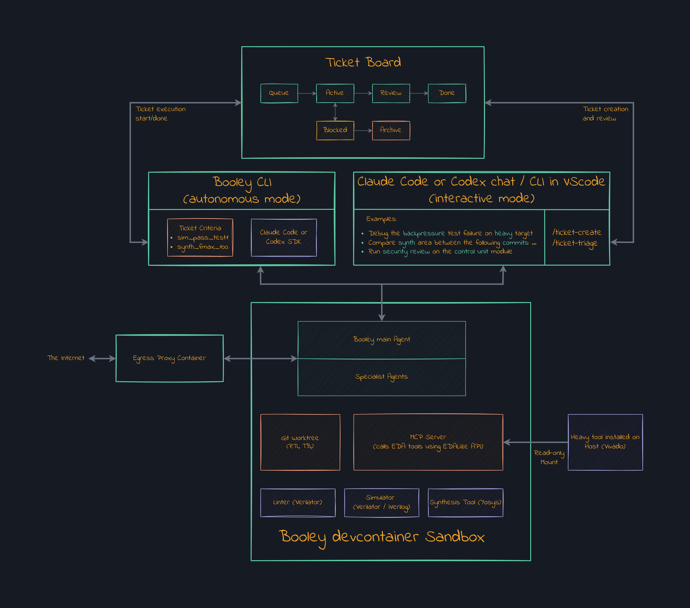

# Architecture

## Read this first

This is the big-picture view of Booley and how its parts fit together. It assumes familiarity with the terms **Booley Flow**, **Target**, **Specialist**, **Session Runtime**, and FuseSoC `.core`; all are defined in the [CONTEXT.md glossary](../CONTEXT.md). Operational commands and capability details belong in [USAGE.md](../user/USAGE.md), while each section below links to deeper technical documentation.

The executable package-direction design and its legacy cycle baseline live in the
[Source Dependency Contract](SOURCE-DEPENDENCY-CONTRACT.md).

## Overview

Booley makes EDA workflows drivable by LLM agents without trusting the agents' claims. It wraps heterogeneous toolchains as **Booley Flows** with structured inputs and machine-checkable results, then exposes those Flows and LLM-backed **Specialists** through MCP.

Everything executes in a containerized **Session Runtime**, one per opened project folder. Two modes share that runtime and the same `.booley_project/` configuration:

- **Interactive Mode** is a human-steered engineering session in a VS Code devcontainer.
- **Ticket Mode** is unattended: `booley run` places a Developer Agent inside a harness that drives work toward explicit acceptance Criteria.

The host owns only bootstrap, runtime lifecycle, trusted EDA registrations and Grants, the egress proxy, and idle reaping. It never executes an agent-controlled command.

The preparation sequence is deliberately one-way:

1. **Host Bootstrap** validates host policy and applications, then reconciles
   shared skills, the PDK cache, the base Session Image, and global sidecars.
2. **Project Initialization** reconciles Project state, the selected or derived
   Session Image, Git integration, and an issued Session Runtime specification.
3. The issued **Session Runtime** hosts Interactive Mode and Ticket Mode.

Both host and Project image scopes cross the same authoritative image-lifecycle
module. A composed forced init refreshes the host-owned base once; Project
reconciliation verifies that immutable identity and refreshes only its owned
descendants.

## The Sandbox

The Session Runtime is the shared execution and containment boundary. The `booley-sandbox` image supplies the open-source simulation, lint, synthesis, timing, and waveform-analysis stack, so most projects need no additional provisioning. It runs as a non-root user with project data mounted in, remains available across editor window closes, and is stopped only by explicit lifecycle commands or the idle reaper. One image-lifecycle module reconciles the selected Session Image and its managed ancestry for init, Doctor, and refresh; callers receive immutable identity and typed diagnostics rather than reimplementing Docker freshness rules. Runtime recreation remains a separate transaction so a failed replacement can restore the prior container. Setup and image customization are covered in [SETUP.md](../user/SETUP.md) and [CONFIG.md](../user/CONFIG.md#custom-sandbox-image); the packaged toolchain is listed in [SUPPORTED-EDA-TOOLS.md](../user/SUPPORTED-EDA-TOOLS.md).

Capabilities fall into two architectural categories. **Booley Flows** deterministically turn structured requests into EDA invocations and their results into evidence. **Specialists** are scoped LLM sub-agents for work such as review and mutation testing. The calling agent reaches both through a uniform MCP surface rather than spawning EDA tools directly. The live capability catalog and controls are in [USAGE.md](../user/USAGE.md#booley-flows--specialists); the build and evidence contracts are in [FLOW_IMPLEMENTATION.md](FLOW_IMPLEMENTATION.md), and the extension model is in [MCP-TOOLS.md](MCP-TOOLS.md).

Source ownership follows those boundaries. Each built-in Flow owns its
tool-specific adapters beneath `src/booley/flows/<flow>/backends/`; for example,
simulation owns Cocotb, Icarus, and Verilator adapters, synthesis owns Yosys and
OpenROAD adapters, and FPGA implementation owns its Vivado adapter. Here
`backends` is an internal package-layout term for interchangeable implementation
adapters. Product configuration and documentation still call the external
program an **EDA tool**, and `eda/provisioning/` separately owns host installation
and licensing policy.

All modes and tickets share the runtime's resources. Admission control therefore treats each Flow, Specialist, and Developer Agent run as a Job in a separately capped Job Class. Excess work queues, with Interactive work ahead of Ticket work, so concurrent sessions cannot exhaust the container's memory. Configuration belongs under [`[jobs]`](../user/CONFIG.md#jobs--concurrency-jobs).

The runtime is network-restricted by default. Deterministic compile and simulation work receives no egress; LLM-backed work receives only provider access. Approved host EDA installations may be mounted read-only, but their tools still execute inside the runtime. This keeps dispatch, configuration, execution, and result interpretation on the container side of the trust boundary.

## Interactive Mode

Interactive Mode is both the hands-on workflow and the front door to the Session Runtime. `booley bootstrap` prepares global lifecycle services, while `booley init` issues this Project's devcontainer specification; reopening the project in the container connects the editor to the full sandbox. The interactive agent reaches Flows, read-only Specialists, B-Wave, and runtime status through an in-container MCP server. Ticket-only controls remain hidden. The service restarts with the container, so reopened sessions reconnect automatically. See [SETUP.md](../user/SETUP.md) for the lifecycle and [USAGE.md](../user/USAGE.md#interactive-mode) for the working interface.

## Ticket Mode

Ticket Mode replaces turn-by-turn human steering with the **Harness** (`src/booley/harness/`), a control loop around the Developer Agent. A run claims a ticket, creates an isolated worktree and branch, and launches the agent inside the Session Runtime. The agent decides what to edit and which Flows or Specialists to invoke; the harness constructs its prompt, mediates MCP calls, tracks Criteria, and persists progress for recovery.

This separation is a verification boundary. The Developer Agent cannot satisfy a Criterion by assertion: only structured evidence returned from a harness-executed Flow or Specialist can do so. Relevant code edits invalidate dependent Criteria and force re-verification. Completed work remains on its branch for human review, while the worktree is runtime-scoped scratch.

Tickets and their transitions live on the filesystem-backed Ticket Board. Their schema, Criteria, queue lifecycle, concurrency, and CLI are documented in [USAGE.md](../user/USAGE.md#ticket-driven-workflow); canonical terminology is in [CONTEXT.md](../CONTEXT.md#work-management).

## B-Wave

**B-Wave** is the agent-facing waveform query layer used by both modes. It converts a trace from an artifact too large for an LLM to inspect into structured questions about signals, events, values, and time ranges. Queries operate on standard FST traces; VCD can be converted at ingestion.

B-Wave does not render waveforms. When a human needs a visual handoff, `bwave gui` opens the relevant signals and time window in an off-the-shelf viewer through its control protocol. This keeps programmatic analysis and GUI presentation separate. Query and viewing commands are documented in [USAGE.md](../user/USAGE.md#viewing-waveforms).

## Backends

Booley is backend-agnostic. One provider—Claude or Codex—is selected for the Developer Agent and nested Specialists, while the MCP capability surface remains the same. Provider selection, model roles, authentication, and billing options are configuration concerns documented under [`[agent]`](../user/CONFIG.md#agent-provider-agent) and in [USAGE.md](../user/USAGE.md#auth--billing).

## Security & Trust Model

Booley treats agent behavior as untrusted, whether caused by error or adversarial input. Agents, MCP tools, Flows, and EDA subprocesses run inside the hardened Session Runtime with no direct host command channel. The container receives only project data, ticket worktrees, and explicitly authorized resources; it has no host home, SSH state, or Docker socket, and runs non-root with dropped capabilities, `no-new-privileges`, memory and PID limits, and default-deny egress.

Ticket work stays on isolated branches until review. Ticket Scope is enforced
at commit time; deviation reporting remains a backstop for older worktrees and
hook bypasses. Runtime/worktree isolation contains the process, while git keeps
changes recoverable.

Host-provisioned EDA follows the same boundary. The host grants an explicitly registered installation; Booley mounts it read-only, revalidates it on resume, and limits any licensing path to a policy-owned fixed-destination relay. Invalid, stale, or revoked authority fails before startup rather than falling back to host execution.

This substantially reduces authority but is not absolute isolation. Residual risks include container or kernel escape, incorrect trusted-host provisioning, vendor executable behavior inside the runtime, and deliberately approved license-server traffic.

## Why these choices

This document describes what Booley is and how it fits together. The load-bearing decisions, alternatives, and costs are in [WHY.md](WHY.md).
