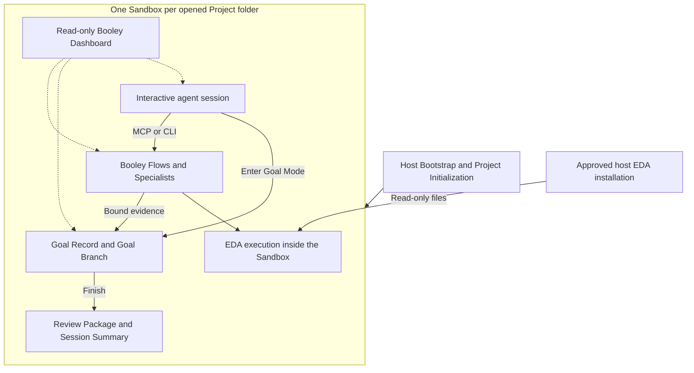

# Architecture

## Read this first

This is the big-picture view of Booley and how its parts fit together. It assumes familiarity with the terms **Booley Flow**, **Target**, **Specialist**, **Sandbox**, and FuseSoC `.core`; all are defined in the [GLOSSARY.md glossary](../GLOSSARY.md). Operational commands and capability details belong in [USAGE.md](../user/USAGE.md), while each section below links to deeper technical documentation.

The executable package-direction design and its legacy cycle baseline live in the
[Source Dependency Contract](SOURCE-DEPENDENCY-CONTRACT.md).

## Overview

Booley makes EDA workflows drivable by LLM agents without trusting the agents' claims. It wraps heterogeneous toolchains as **Booley Flows** with structured inputs and machine-checkable results, then exposes those Flows and LLM-backed **Specialists** through MCP.

Everything executes in a containerized **Sandbox**, one per opened project folder. Two modes share that runtime and the same `.booley_project/` configuration:

- **Interactive Mode** is a human-steered engineering session in a VS Code devcontainer.
- **Goal Mode** binds an agent session's work to mandatory Goals in a linked worktree on a Goal Branch. The human may steer it or leave the tab working unattended; `/booley-goal` guides entry, changes, and Finish.

The host owns only bootstrap, runtime lifecycle, trusted EDA registrations and Grants, the egress proxy, and idle reaping. It never executes an agent-controlled command.

The preparation sequence is deliberately one-way:

1. **Host Bootstrap** validates host policy and applications, then reconciles
   shared skills, the PDK cache, the base Sandbox Image, and global sidecars.
2. **Project Initialization** reconciles Project state, the selected or derived
   Sandbox Image, Git integration, and an issued Sandbox specification.
3. The issued **Sandbox** hosts Interactive Mode and Goal Mode.

Both host and Project image scopes cross the same authoritative image-lifecycle
module. A composed forced init refreshes the host-owned base once; Project
reconciliation verifies that immutable identity and refreshes only its owned
descendants.

```mermaid
flowchart TD
    Host[Host Bootstrap and Project Initialization] --> Sandbox
    HostEDA[Approved host EDA installation] -->|Read-only files| EDA
    subgraph Sandbox[One Sandbox per opened Project folder]
        Session[Interactive agent session] -->|Enter Goal Mode| Goals[Goal Record and Goal Branch]
        Session -->|MCP or CLI| Capabilities[Booley Flows and Specialists]
        Capabilities --> EDA[EDA execution inside the Sandbox]
        Capabilities -->|Bound evidence| Goals
        Goals -->|Finish| Package[Review Package and Session Summary]
        Dashboard[Read-only Booley Dashboard] -.-> Session
        Dashboard -.-> Goals
        Dashboard -.-> Capabilities
    end
```

## The Sandbox

The Sandbox is the shared execution and containment boundary. The `booley-sandbox` image supplies the open-source simulation, lint, synthesis, timing, and waveform-analysis stack, so most projects need no additional provisioning. It runs as a non-root user with project data mounted in, remains available across editor window closes, and is stopped only by explicit lifecycle commands or the idle reaper. One image-lifecycle module reconciles the selected Sandbox Image and its managed ancestry for init, Doctor, and refresh; callers receive immutable identity and typed diagnostics rather than reimplementing Docker freshness rules. Sandbox recreation remains a separate transaction so a failed replacement can restore the prior container. Setup and image customization are covered in [SETUP.md](../user/SETUP.md) and [CONFIG.md](../user/CONFIG.md#custom-sandbox-image); the packaged toolchain is listed in [SUPPORTED-EDA-TOOLS.md](../user/SUPPORTED-EDA-TOOLS.md).

Capabilities fall into two architectural categories. **Booley Flows** deterministically turn structured requests into EDA invocations and their results into evidence. **Specialists** are scoped LLM sub-agents for work such as review and mutation testing. The calling agent reaches both through a uniform MCP surface rather than spawning EDA tools directly. The live capability catalog and controls are in [USAGE.md](../user/USAGE.md#booley-flows--specialists); the build and evidence contracts are in [FLOW_IMPLEMENTATION.md](FLOW_IMPLEMENTATION.md), and the extension model is in [MCP-TOOLS.md](MCP-TOOLS.md).

Source ownership follows those boundaries. Each built-in Flow owns its
tool-specific adapters beneath `src/booley/flows/<flow>/backends/`; for example,
simulation owns Cocotb, Icarus, and Verilator adapters, synthesis owns Yosys and
OpenROAD adapters, and FPGA implementation owns its Vivado adapter. Here
`backends` is an internal package-layout term for interchangeable implementation
adapters. Product configuration and documentation still call the external
program an **EDA tool**, and `eda/provisioning/` separately owns host installation
and licensing policy.

All sessions share the runtime's resources. Admission control treats each Flow or Specialist run as a Job in a separately capped Job Class (`heavy` for EDA work, `light` for model-bound Specialist work). Excess work queues without preempting running Jobs. Queue priority comes from requester role, independently of Job Class: `interactive` sorts ahead of `ticket`; unknown roles get the `ticket` priority. Goal Mode uses the session's agent rather than launching a separately admitted Developer Agent. The legacy `ticket` class is retained until Phase 9a removes the Ticket execution code. Configuration belongs under [`[jobs]`](../user/CONFIG.md#jobs--concurrency-jobs).

The runtime is network-restricted by default. Deterministic compile and simulation work receives no egress; LLM-backed work receives only provider access. Approved host EDA installations may be mounted read-only, but their tools still execute inside the runtime. This keeps dispatch, configuration, execution, and result interpretation on the container side of the trust boundary.

## Interactive Mode

Interactive Mode is both the hands-on workflow and the front door to the Sandbox. `booley bootstrap` prepares global lifecycle services, while `booley init` issues this Project's devcontainer specification; reopening the project in the container connects the editor to the full sandbox. The interactive agent reaches Flows, read-only Specialists, B-Wave, and runtime status through an in-container MCP server. Goal MCP tools are listed only by interactive, non-nested servers and are not filtered by `BOOLEY_MCP_TOOLS`. The ordinary `BOOLEY_MCP_MODE=interactive` filter hides the retired `submit_run_report`; default servers can still expose it, and nested or explicit tool allowlists take precedence over that filter. The service restarts with the container, so reopened sessions reconnect automatically. See [SETUP.md](../user/SETUP.md) for the lifecycle and [USAGE.md](../user/USAGE.md#interactive-mode) for the working interface.

## Goal Mode

Goal Mode uses the existing agent session rather than launching a separate Ticket loop. Entry requires a clean linked worktree and creates a Goal Branch from HEAD. The worktree owns one Goal Record; any session in that worktree may continue it. While any Goal Record occupies the Project, a Booley Flow, Specialist or custom-tool call, a report fetch, or a Goal tool call without explicit `work_dir` is refused (so is any such call while a Goal Record is unreadable): “Pass work_dir on every Booley call while Goal Mode is active”. This Project-wide rule also applies to calls intended to run outside the Goal worktree. Calls into an occupied Goal worktree capture an immutable Run Binding to the record, its Goal specifications, and Protected Inputs.

Ordinary CLI Flow calls remain diagnostic; evidence that should count toward a Goal runs through MCP with its Run Binding.

The agent cannot meet a Goal by assertion: only structured Booley Flow or Specialist evidence counts. Publication revalidates the Run Binding, and relevant source or Target changes make old evidence stale. A Goal Change Proposal requires human approval and is recorded in the Change Log. Finish requires fresh evidence for every Goal at a clean committed HEAD, unchanged Protected Inputs, and a Session Summary; it presents a Review Package without merging the branch. Abandon keeps the work and the abandoned record.

`booley goal` provides status and abandonment, and `booley dashboard` is the read-only Sandbox view. See [USAGE.md](../user/USAGE.md#goal-mode), [ADR 0067](../adr/0067-replace-ticket-mode-with-goal-mode.md), and the [Goal Mode glossary](../../src/booley/goals/GLOSSARY.md).

### Retained Ticket implementation

Ticket Mode is retired: `booley run` and `booley board` print a Goal Mode pointer and exit 2. The Ticket workflow, including the `harness/developer.py` loop, Developer Agent, Ticket Preflight, and Ticket Console, is unreachable through the public CLI and retained until Phase 9a removes it.

The `ticket_board/` package still contains live shared dependencies: Goal Flow loading uses `flow_runner.load_project_flow`; Specialists use `agent_execution`, `waiver_candidates`, and `criteria_acceptance`/`review_policy`; Goal waiver handling also uses `waiver_candidates`. Unbound MCP calls construct `TicketAcceptanceRecorder`, and `booley flow` retains its `BOOLEY_TICKET_FILE` execution adapter. Phase 9a relocates shared execution/evidence dependencies to `evidence/` or `goals/` and removes Ticket-only adapters before deleting the package. The [Ticket Board glossary](../../src/booley/ticket_board/GLOSSARY.md) documents that retained vocabulary. The `booley.harness` package also owns active CLI, setup, and Doctor modules and is not itself retired.

## B-Wave

**[B-Wave](../../crates/bwave/GLOSSARY.md)** is the agent-facing waveform query layer used by both modes. It converts a trace from an artifact too large for an LLM to inspect into structured questions about signals, events, values, and time ranges. Queries operate on standard FST traces; VCD can be converted at ingestion.

B-Wave does not render waveforms. When a human needs a visual handoff, `bwave gui` opens the relevant signals and time window in an off-the-shelf viewer through its control protocol. This keeps programmatic analysis and GUI presentation separate. Query and viewing commands are documented in [USAGE.md](../user/USAGE.md#viewing-waveforms).

## Backends

Booley is backend-agnostic. One provider—Claude or Codex—is configured for agent sessions and nested Specialists, while the MCP capability surface remains the same. Provider selection, model roles, authentication, and billing options are configuration concerns documented under [`[agent]`](../user/CONFIG.md#agent-provider-agent) and in [USAGE.md](../user/USAGE.md#auth--billing).

## Security & Trust Model

Booley treats agent behavior as untrusted, whether caused by error or adversarial input. Agents, MCP tools, Flows, and EDA subprocesses run inside the hardened Sandbox with no direct host command channel. The container receives only project data, linked worktrees, and explicitly authorized resources; it has no host home, SSH state, or Docker socket, and runs non-root with dropped capabilities, `no-new-privileges`, memory and PID limits, and default-deny egress.

Goal work stays on its Goal Branch for review. Protected Input checks guard
evidence-producing configuration, while the Review Package exposes changed
files, Targets, and constraints. Goal Mode has no Ticket Scope allowlist.
Sandbox/worktree isolation contains the process, while git keeps changes recoverable.

Host-provisioned EDA follows the same boundary. The host grants an explicitly registered installation; Booley mounts it read-only, revalidates it on resume, and limits any licensing path to a policy-owned fixed-destination relay. Invalid, stale, or revoked authority fails before startup rather than falling back to host execution.

This substantially reduces authority but is not absolute isolation. Residual risks include container or kernel escape, incorrect trusted-host provisioning, vendor executable behavior inside the runtime, and deliberately approved license-server traffic.

## Why these choices

This document describes what Booley is and how it fits together. The load-bearing decisions, alternatives, and costs are in [WHY.md](WHY.md).
